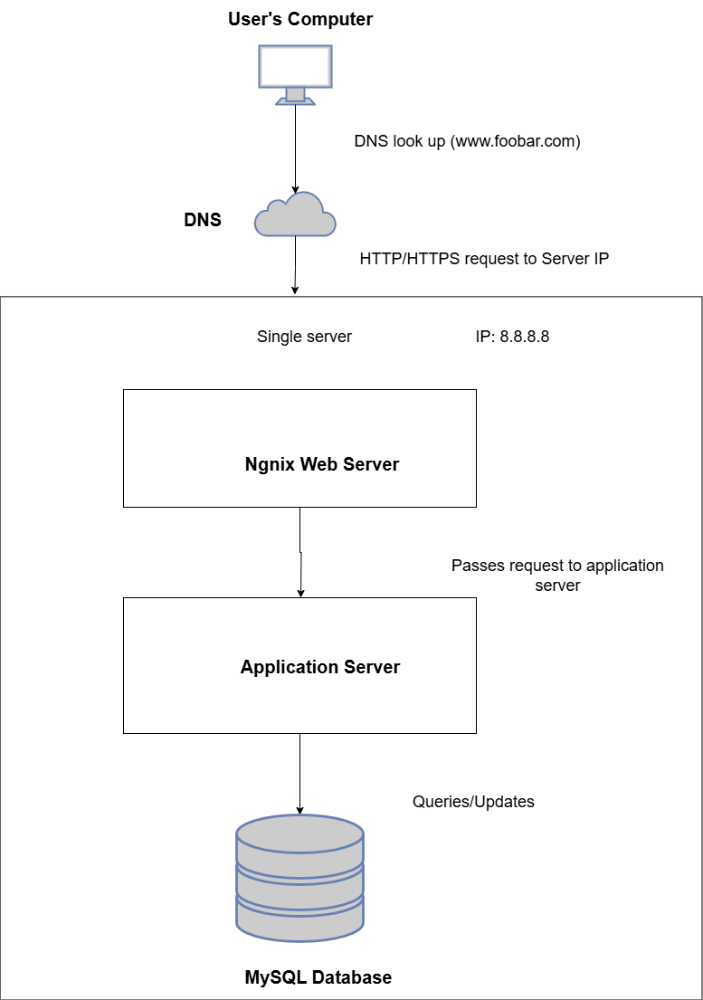

<!--Inital readme file added
-->
# 0x09 - Web Infrastructure Design

This project explores different **web infrastructure designs** and their components, starting from a simple single-server setup to a more scalable, secured, and monitored architecture.

---

## 0. Simple Web Stack

**Description:**  
A single server setup hosting a website **www.foobar.com** with:
- Nginx (Web Server)
- Application Server
- MySQL Database
- Domain name with **A record** pointing `www.foobar.com` to the server IP

**Pros:** Simple to set up and cost-effective.  
**Cons:** Single Point of Failure (SPOF), no scalability, downtime during maintenance.

---

## 1. Distributed Web Infrastructure

**Description:**  
A three-server setup introducing:
- Load Balancer (HAProxy)
- Separate Web Server and Application Server
- Database with Primary-Replica setup

**Improvements:**  
- Traffic distribution via Load Balancer  
- Separation of concerns (web, app, database)  
- Database replication for better read performance

**Cons:**  
- Load Balancer and Primary DB remain SPOFs  
- Still lacks security layers and monitoring

---

## 2. Secured and Monitored Web Infrastructure

**Description:**  
Same as the distributed setup, plus:
- **3 Firewalls** (edge, app server, database)
- **SSL Certificate** for HTTPS
- **Monitoring Clients** on each server (e.g., Sumologic)

**Benefits:**  
- Improved security through firewalls and encrypted traffic  
- Monitoring for performance and failure detection

**Cons:**  
- SSL termination at Load Balancer may expose internal traffic if not re-encrypted  
- Only one writable MySQL server (Primary DB is a SPOF)  
- All-in-one server roles can cause resource contention

---

## 3. Scale Up

**Description:**  
Scaling the infrastructure by:
- Adding another HAProxy for **Load Balancer Cluster** (High Availability)
- Splitting components onto their own servers:
  - Web Server (Nginx)
  - Application Server
  - Database Server (MySQL)

**Benefits:**  
- Eliminates SPOF at the load balancer layer  
- Easier scaling of individual components  
- Clear separation of responsibilities

---

## Summary

These designs demonstrate the **evolution of web infrastructure**:

1. **Simple Stack** → Minimal setup for small-scale applications.  
2. **Distributed** → Adds load balancing, replication, and separation of components.  
3. **Secured & Monitored** → Adds encryption, firewalls, and performance monitoring.  
4. **Scale Up** → Adds redundancy, improves scalability, and isolates workloads.

Each step addresses some limitations of the previous one while introducing new considerations for security, performance, and availability.

